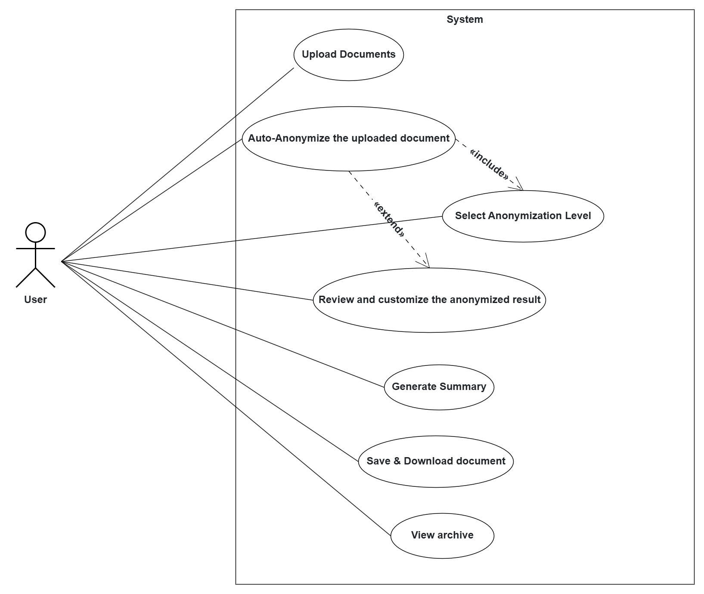
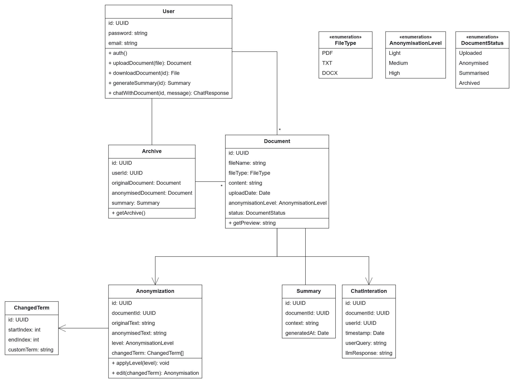
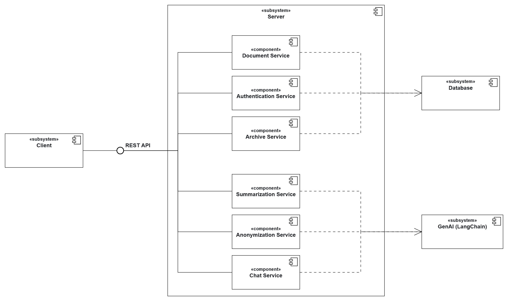

# 📝 System Overview & Architecture

# 1. Initial System Structure

## Use Case Diagram

The Use Case Diagram illustrates the interactions between users and the system, highlighting the primary functionalities and user roles.

## Analysis Object Model Diagram

The Analysis Object Model represents the UML class diagram of different server services and their relationships. 

## High-level Architecture Diagram

The High-level Architecture Diagram provides an overview of the system's structure, including its main components, data flow, and interactions.

# 2. First Product Backlog

## User Stories

### 2.0 User Story 0

1. As a user, I want to upload documents in various formats (PDF at first) so that I can work with the files I already have.
2. As a user, I want to anonymize my document so that I can share it without revealing sensitive information.
3. As a user, I want to manually review the anonymization process so that I can ensure all sensitive information is properly handled.
4. As a user, I want to be able to select the level of anonymization (e.g. light, medium, heavy) based on my needs.
5. As a user, I want to save and download the anonymized document in my desired format so that I can use it as needed.
6. As a user, I want to be able to generate a summary of the document so that I can quickly understand its content.
7. As a user, I want an archive of my documents so that I can keep track of my Original vs. anonymized files as well as the generated summary.

### 2.1 User Story 1 - Upload Document

> As a user, I want to upload documents in various formats (PDF at first) so that I can work with the files I already have.

- I want to be able to click a button to select files from my computer.
- I want to be able to drag and drop files into the upload area.
- I want to see a progress bar/loading indicator indicating the upload status.

### 2.2 User Story 2 - Auto-Anonymization

> As a user, I want to anonymize my document so that I can share it without revealing sensitive information.

- I want the system to automatically detect and redact personal information (e.g. names, addresses) from the document.
- I want to see a preview of the anonymized document before finalizing the process.
- I want to be able to select the level of anonymization (e.g. light, medium, heavy) based on my needs.

### 2.3 User Story 3 - Manual Review & Customization

> As a user, I want to manually review the anonymization process so that I can ensure all sensitive information is properly handled.

- I want to see sections of the document that have been anonymized - automatically highlighted.
- I want to see the original text on top of the anonymized text.
- The original text should be red and the anonymized text should be green.
- I want to be able to click on the highlighted sections to edit the anonymized text.
- I want to be able to have freedom to select any other text in the document to be anonymized.

### 2.4 User Story 4 - Level of Anonymization

> As a user, I want to be able to select the level of anonymization (e.g. light, medium, heavy) based on my needs.

- I want to see a slider or dropdown menu to select the level of anonymization.
- I want to see a description of what each level of anonymization means (e.g. light = names only, medium = names and addresses, heavy = all personal information).
- I want to be able to change the level of anonymization at any time during the process.
- I want to see a preview of the document with the selected level of anonymization applied.

### 2.5 User Story 5 - Save & Download

> As a user, I want to be able to save and download the anonymized document in my desired format so that I can use it as needed.

- I want to be able to click a button to save the anonymized document - Local storage.
- I want to be able to download the anonymized document in my desired format.
- I want to see a confirmation message after the document is saved/downloaded.

### 2.6 User Story 6 - Summarization

> As a user, I want to be able to generate a summary of the document so that I can quickly understand its content.

- I want to be able to click a button to generate a summary of the original uploaded document (without having to anonymize it).
- I want to the summarize button to work exactly the same even after the anonymization process is complete.
- I want to be able to save the generated summary in my desired format and download it.
- I want to see a confirmation message after the summary is saved/downloaded.

### 2.7 User Story 7 - Archive

> As a user, I want to have an archive of my documents so that I can keep track of my Original vs. anonymized files as well as the generated summary.

- I want to see a list of all my uploaded documents in the archive.
- I want to have a side by side comparison view to see the original and anonymized versions of each document in the archive (separate page).
- I want to be able to search for specific documents in the archive, based on their file names.

### Summary Table

| ID   | Title                         | Acceptance Criteria                                                                                                                                                                       |
| ---- | ----------------------------- | ----------------------------------------------------------------------------------------------------------------------------------------------------------------------------------------- |
| US-1 | Upload Document               | - Click to select files from computer - Drag & drop into upload area - Show upload progress bar                                                                                     |
| US-2 | Auto-Anonymization            | - Automatically detect & redact PII (names, addresses, etc.) - Show preview of redactions - Offer light/medium/heavy levels                                                         |
| US-3 | Manual Review & Customization | - Highlight auto-anonymized sections - Show original text (in red) over anonymized text (in green) - Allow click-to-edit anonymized text - Allow selecting any text to anonymize |
| US-4 | Select Anonymization Level    | - Slider or dropdown to choose level - Descriptions for light/medium/heavy - Live preview updates on change                                                                         |
| US-5 | Save & Download               | - “Save” button stores anonymized document locally - “Download” button exports in chosen format (PDF, DOCX, TXT) - Confirmation message on success                                  |
| US-6 | Generate Summary              | - “Summarize” button works before or after anonymization - Displays summary of original document - Save/download summary in chosen format - Confirmation message on success      |
| US-7 | Document Archive              | - List all uploaded documents (original, anonymized, summary) - Side-by-side view of original vs. anonymized - Search by file name in archive                                       |
